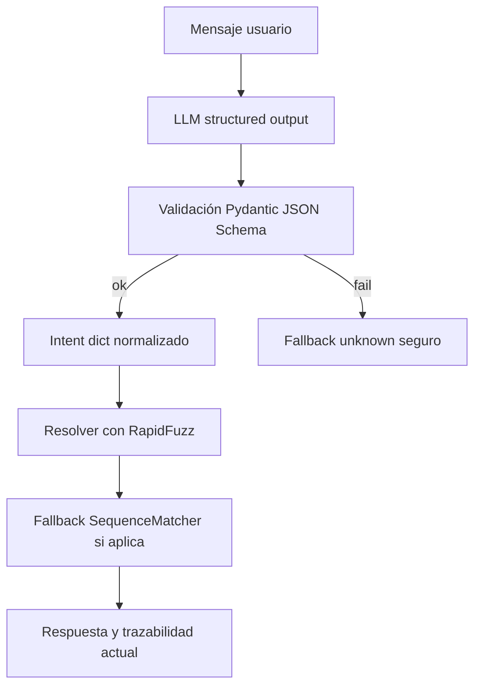

# Plan de adopción híbrida para ecoFlow (sin reescritura)

## Fase aprobada por usuario (incremental y disciplinada)

### Incluido en esta fase

1. Structured Outputs / tool call en `cognitive_service.py` manteniendo `parse_intent(...) -> dict`.
2. RapidFuzz en `resolver.py` como motor principal de similitud, con fallback a `SequenceMatcher`.
3. Modelos/esquemas mínimos para extracción estructurada tipada.

### Excluido en esta fase

- No checkpoints.
- No operation gate transversal.
- No dateparser.
- No refactor grande de `orchestrator.py`.
- No nueva capa completa de guardrails.
- No reescritura arquitectónica.

## Alcance y decisiones cerradas

- RapidFuzz como motor principal de similitud y `difflib.SequenceMatcher` como fallback.
- Validación fuerte con Pydantic + JSON Schema interno.
- Sin librería externa de guardrails en esta fase.
- Sin cambios de arquitectura fuera del core mínimo aprobado.

---

## 1) Qué patrón resuelve qué problema real de ecoFlow

| Referencia | Patrón aplicable | Problema real que resuelve en ecoFlow |
|---|---|---|
| Rasa CALM (flows/slots) | Flujos explícitos por dominio + slots requeridos/ opcionales + prompts de slot pendiente | En `orchestrator.py` hay lógica extensa y heurísticas ad-hoc; cuesta mantener huecos de datos, reintentos y confirmaciones homogéneas |
| LangGraph (persistence/interrupts/checkpoints) | Checkpoints por paso de flujo + interrupciones controladas + reanudación idempotente | Aunque hay persistencia en `session_data`, no hay snapshots con motivo, versión y rollback granular por paso crítico |
| Structured Outputs / JSON Schema | Contrato estructurado estricto para intención y entidades | `cognitive_service.py` usa JSON libre con defaults, pero no aplica validación fuerte de esquema ni versionado de contrato de salida |
| RapidFuzz | Ranking fuzzy estable y configurable por umbrales por dominio | `resolver.py` usa `SequenceMatcher` con umbrales fijos, útil pero menos robusto ante variaciones reales y volumen mayor |
| spaCy EntityRuler / matchers | Reglas deterministas para patrones frecuentes (CIF, PKEY, comandos cortos, intenciones operativas) | Parte de esta lógica está dispersa en regex y reglas en `orchestrator.py`; falta capa declarativa central reutilizable |
| dateparser / Recognizers-Text | Normalización robusta de fechas en lenguaje natural a ISO + rangos | En servicios y tareas hay parsing parcial de fecha/hora; falta normalización consistente auditada |
| Guardrails / validación tipada | Policy gate tipado antes de herramientas ERP | Ya existe control de confirmaciones, pero falta una puerta unificada por operación con validadores tipados por payload |

---

## 2) Qué copiaría tal cual

1. **Modelo híbrido LLM + determinismo**: conservar el patrón actual de `parse_intent` + enrutado determinista.
2. **Persistencia en PostgreSQL con `session_data`**: base correcta para continuidad multi-turno.
3. **Doble confirmación para acciones de riesgo**: ya implementada y alineada con operación segura.
4. **Separación por capas**: transporte en `chat_service.py`, decisión en orquestador, ejecución en tools/connectors.

---

## 3) Qué adaptaría parcialmente

1. **Rasa CALM flows/slots** → Adaptar a ecoFlow como `FlowSpec` interno por dominio.
   - No migrar framework.
   - Sí introducir catálogo declarativo de slots y validaciones.
2. **LangGraph checkpoints** → Adaptar a snapshots ligeros dentro del estado persistido.
   - Sin motor de grafos externo.
   - Sí incluir `checkpoint_id`, `flow_mode`, `step`, `pending_field`, `candidate_hash`, `ts`.
3. **Structured Outputs** → Mantener proveedor actual, pero con validación Pydantic estricta post-LLM.
   - Si falla validación: degradar a `intent=unknown` + evento de observabilidad.
4. **RapidFuzz** → Integrar en resolver para deduplicación y ambigüedad.
   - Mantener `SequenceMatcher` como fallback.
5. **spaCy matchers** → Empezar por motor de reglas ligero (regex + diccionario de patrones) desacoplado.
   - Evaluar `EntityRuler` más adelante cuando crezca el catálogo.
6. **dateparser** → Integrar ya en extracción de fecha/hora de tareas/servicios.
   - Recognizers-Text queda para fase posterior si hay necesidad multinorma más avanzada.

---

## 4) Qué descartaría en esta fase

1. Reemplazar ecoFlow por Rasa o LangGraph completos.
2. Añadir librería externa de guardrails antes de validar valor real con la capa tipada interna.
3. Sobrediseñar con orquestación distribuida o colas nuevas para este objetivo.
4. Introducir NLP pesado en todos los dominios de golpe; primero reglas de alto impacto.

---

## 5) Cambios concretos al repo para esta iteración aprobada

## 5.1 Archivos permitidos en alcance

- **Nuevo** `app/models/schemas/cognitive_contracts.py`
  - Modelos Pydantic estrictos para salida cognitiva mínima.
  - JSON Schema interno para validación post-LLM.

- **Modificar** `app/services/cognitive_service.py`
  - Mantener `parse_intent(...) -> dict`.
  - Añadir validación estructurada y degradación segura.

- **Modificar** `app/services/resolver.py`
  - RapidFuzz como motor principal de similitud.
  - Fallback explícito a SequenceMatcher.

- **Modificar solo si es necesario** `app/models/schemas/llm.py`
  - Ajuste mínimo de compatibilidad de contrato.

- **Modificar** `requirements.txt`
  - Añadir únicamente `rapidfuzz`.

- **Tests focalizados**
  - Nuevo `tests/test_cognitive_contracts.py`.
  - Nuevo `tests/test_resolver_fuzzy.py`.
  - Ajuste de `tests/run_regression_operational_guardrails.py`.

## 5.2 Exclusiones obligatorias de esta iteración

- No crear `app/services/guardrails/operation_gate.py`.
- No crear `app/services/checkpoints.py`.
- No crear `app/services/patterns/rule_matcher.py`.
- No refactor grande de `app/services/orchestrator.py`.
- No añadir `dateparser`.
- No añadir librería externa de guardrails.

## 5.3 Flujo operativo mínimo de implementación

## 5.4 Plan de pruebas obligatorias en serverIA

1. Suite focalizada:
   - `tests/test_cognitive_contracts.py`
   - `tests/test_resolver_fuzzy.py`
   - `tests/run_regression_operational_guardrails.py`
2. Regresión completa obligatoria:
   - `tests/run_regression_1_7.py`
   - `tests/run_regression_8_12.py`
   - `tests/run_field_roundtrip_verification_real.py`

## 5.5 Criterios PASS/FAIL de aprobación

- **PASS**
  1. Sin regresión en `run_regression_1_7`, `run_regression_8_12`, `operational_guardrails` y `roundtrip_real`.
  2. Mejora medible en extracción estructurada.
  3. Mejora medible en similitud y gestión de duplicados.
  4. Cero operaciones ERP incorrectas por falsa resolución.

- **FAIL**
  1. Cualquier regresión en suites obligatorias.
  2. Cualquier resolución falsa que provoque operación ERP incorrecta.
  3. Cualquier degradación que rompa continuidad conversacional estable.
